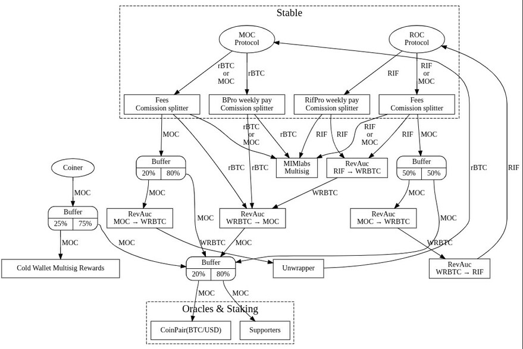
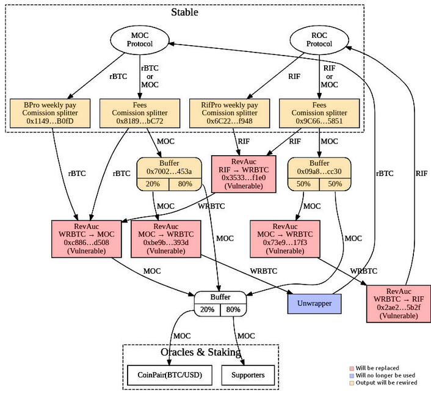
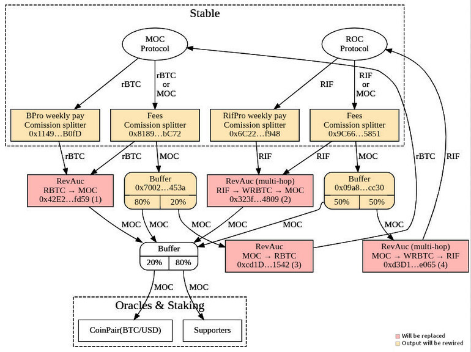

# Proposal: Reverse Auction Flow Upgrade Using TWAP Pricing

## Overview

This document proposes a change to the Money on Chain (MoC) protocol flow related to the use of **Reverse Auction** contracts.

A security issue has been identified in one of the existing Reverse Auction contracts, where an attacker was able to exploit a **Flash Loan–based price manipulation attack** to interfere with the purchase price of MOC tokens.

The full technical details of the attack and its execution is documented in a [separate post](attack.md).

## Problem Statement

The detected vulnerability allows an attacker to:

- Take a flash loan
- Perform a typical **sandwich attack** by manipulating on‑chain prices
- Buy and sell MOC tokens within the same transaction
- Extract profit from the price difference created by the manipulation

Because current Reverse Auction contracts rely on spot prices at execution time, they are vulnerable to short‑lived price distortions caused by flash loans.

## Proposed Changes

### 1. Replace All Reverse Auction Contracts

All existing Reverse Auction contracts will be **fully replaced** by a new version with enhanced price‑control mechanisms.

The new Reverse Auction contracts will:

- Enforce swap execution prices using a **TWAP (Time‑Weighted Average Price)** algorithm
- Use an external price source resistant to short‑term manipulation
- Prevent swaps from executing outside an acceptable price range

This approach makes flash loan–based price manipulation economically unviable.

### 2. Reconfigure Dependent Contracts

All contracts currently wired to the output of existing Reverse Auctions (such as **buffers** and **splitters**) must be reconfigured to reference the newly deployed Reverse Auction contracts.

No legacy Reverse Auction contracts will remain connected in the protocol flow.

### 3. Route Optimization and Multi‑Hop Support

The new Reverse Auction implementation supports **multi‑hop swap paths**, enabling routing optimizations.

As a result:

- The total number of Reverse Auctions in the flow will be reduced from **5 to 4**
- Swap paths will be updated accordingly

### 4. Removal of the Unwrapper Contract

The current **Unwrapper** contract will no longer be required.

The new Reverse Auction contracts are capable of:

- Handling outputs directly in **basecoin**
- Eliminating the need for a separate unwrapping step

This simplifies the overall contract topology and reduces operational complexity.

### 5. Protocol Registry Update

The protocol **Registry** will be updated to:

- Remove references to all legacy Reverse Auction contract addresses
- Register the addresses of the newly deployed Reverse Auction contracts

This ensures that all protocol components resolve to the upgraded infrastructure.

### 6. Execution Threshold Adjustment

Execution thresholds of the legacy Reverse Auction contracts being replaced will be **lowered to zero**.

This measure ensures that:

- No funds remain trapped in deprecated contracts
- All remaining balances can be safely drained or migrated

### 7. Governance Process

As with all protocol‑level changes, this proposal will be submitted to a **governance vote** within the Money on Chain governance system.

Upon approval, deployment and reconfiguration will be executed following standard upgrade procedures.

## Summary

This proposal strengthens the Money on Chain protocol against flash loan–based price manipulation attacks by:

- Replacing all Reverse Auction contracts with TWAP‑protected versions
- Simplifying routing through multi‑hop support
- Removing unnecessary components
- Updating registries and execution thresholds
- Preserving decentralization through governance approval

The proposed changes significantly improve security, robustness, and maintainability of the Reverse Auction flow.

### General flow diagram

This is a simplified diagram to provide an overview.

### Diagram showing only contracts related to vulnerable Reverse auctions

Focused solely on contracts that need to be updated, discarded, or rewired.

### Diagram with the proposed upgrade

This diagram shows how Flow will look after the change.

## Reverse Auction that will be replaced

|      Path       |                                                      Address                                                      |
| :-------------: | :---------------------------------------------------------------------------------------------------------------: |
| `WRBTC` → `RIF` | [`0x2ae2…5b2f`](https://rootstock.blockscout.com/address/0x2Ae2870424E1bad972157c860C9e06f870e15b2f?tab=contract) |
| `RIF` → `WRBTC` | [`0x3533…f1e0`](https://rootstock.blockscout.com/address/0x3533bd069Ed7dA74C2274869Cd930778e8edF1E0?tab=contract) |
| `WRBTC` → `MOC` | [`0xc886…d508`](https://rootstock.blockscout.com/address/0xc8863d91604A12cE6073cA6A01D00172BB9BD508?tab=contract) |
| `MOC` → `WRBTC` | [`0xbe9b…393d`](https://rootstock.blockscout.com/address/0xbe9B273d23A6ED9ca0df098bF70ac79bAD5D393D?tab=contract) |
| `MOC` → `WRBTC` | [`0x73e9…17f3`](https://rootstock.blockscout.com/address/0x73e9DabfcDAE8e50BAF9F6FaDd2F4f8b845E17f3?tab=contract) |

## Contracts that will no longer be used

|    Name     |                                                      Address                                                      |
| :---------: | :---------------------------------------------------------------------------------------------------------------: |
| `Unwrapper` | [`0x957F…188D`](https://rootstock.blockscout.com/address/0x957F0bCE2aeD894BA5D96894157edaC84239188D?tab=contract) |

## New Reverse Auction

|  #  |          Path           |                                                      Address                                                      |
| :-: | :---------------------: | :---------------------------------------------------------------------------------------------------------------: |
|  1  |     `RBTC` → `MOC`      | [`0x42E2…fd59`](https://rootstock.blockscout.com/address/0x42E29760D05CfB229D4075C75238Ec82Fb94fd59?tab=contract) |
|  2  | `RIF` → `WRBTC` → `MOC` | [`0x323f…4809`](https://rootstock.blockscout.com/address/0x323f6117A256E8f697Ac8d2816eb71e9B7134809?tab=contract) |
|  3  |     `MOC` → `RBTC`      | [`0xcd1D…1542`](https://rootstock.blockscout.com/address/0xcd1D5d171a466A103c3A078C6770dEb801011542?tab=contract) |
|  4  | `MOC` → `WRBTC` → `RIF` | [`0xd3D1…e065`](https://rootstock.blockscout.com/address/0xd3D1aFc638cEF2C55D2Ee33e0C355972f11Be065?tab=contract) |

## Contracts whose output will be rewired

|         Type          |                                                      Address                                                      |
| :-------------------: | :---------------------------------------------------------------------------------------------------------------: |
| `Commission splitter` | [`0x1149…B0fD`](https://rootstock.blockscout.com/address/0x114921bcbd5fc34E103494d338cA492B9400B0fD?tab=contract) |
| `Commission splitter` | [`0x6C22…f948`](https://rootstock.blockscout.com/address/0x6C22ff31fbdF725d30F206efFF9f8a2a11fAf948?tab=contract) |
| `Commission splitter` | [`0x60cE…6E47`](https://rootstock.blockscout.com/address/0x60cEEf03AA1AA96263e297D220EE4EBc3c6b6E47?tab=contract) |
| `Commission splitter` | [`0x9C66…5851`](https://rootstock.blockscout.com/address/0x9C66296938d849802fFa879A20fdC11B58C55851?tab=contract) |
|       `Buffer`        | [`0x7002…453A`](https://rootstock.blockscout.com/address/0x7002dD3027947aB98cA3DDC28F93F2450281453A?tab=contract) |
|       `Buffer`        | [`0x09A8…CC30`](https://rootstock.blockscout.com/address/0x09A84d61c1A10f1D5fb3267DFb00D16ca0DaCC30?tab=contract) |

## Technical procedure

> :warning: Warning: some technical/coding knowledge is necessary to fully understand this document.

In order to fix these contracts a change contract must be deployed and it will be necessary go through the voting process to make the changes.

### The changer contract to vote would be:

|          Name          |                                          Address (and link to verified code in RSK blockscout explorer)                                          |
| :--------------------: | :----------------------------------------------------------------------------------------------------------------------------------------------: |
| `SetNewReverseAuction	` | [`0xf900643c9E78923fA83fdD00288dE5Bcb346bE67`](https://rootstock.blockscout.com/address/0xf900643c9E78923fA83fdD00288dE5Bcb346bE67?tab=contract) |
