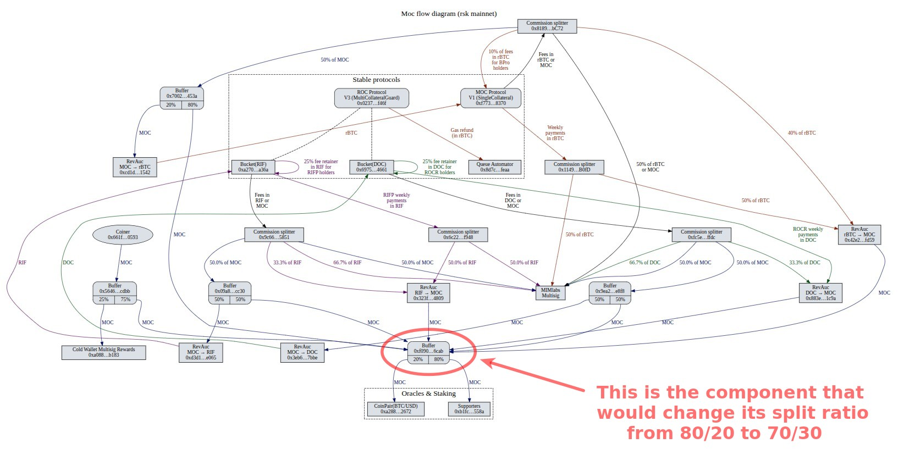

# Oracle Incentive Rebalancing and Protocol Cleanup Upgrade

## Overview

This proposal introduces a set of changes to the Money on Chain (MoC) protocol aimed at improving oracle network sustainability, increasing protocol robustness, simplifying legacy code paths, and addressing identified bugs.

The proposal has two primary objectives:

- Improve incentives for oracle node operators and complete follow-up tasks enabled by the [Oracle Reliability Fix](https://forum.moneyonchain.com/t/oracle-reliability-fix-and-protocol-unpause-proposal/459).
- Introduce additional protocol maintenance improvements and bug fixes that can be efficiently executed as part of the same governance upgrade process.

The main objective is to improve incentives for oracle node operators by increasing their share of protocol incentives. A stronger and more attractive oracle ecosystem is expected to increase the number of active operators, improving protocol decentralization and resilience.

The proposal also includes maintenance and cleanup tasks made possible by the implementation of the [Oracle Reliability Fix](https://forum.moneyonchain.com/t/oracle-reliability-fix-and-protocol-unpause-proposal/459), as well as protocol improvements and bug fixes that can be executed as part of the same governance upgrade.

## Problem Statement

One of the contributing factors that increased the impact of the issues addressed by the [Oracle Reliability Fix](https://forum.moneyonchain.com/t/oracle-reliability-fix-and-protocol-unpause-proposal/459) was the limited number of active oracle operators participating in the protocol.

A larger and more decentralized oracle network increases protocol robustness and reduces operational risk by distributing oracle responsibilities among a broader set of participants.

The current incentive distribution allocates:

- 20% of incentives to Oracle Operators
- 80% of incentives to MoC Stakers

These incentives are funded through:

- **Annual payments from `BPRO` and `RIFPRO` holders**, prorated and distributed weekly
- **Protocol fees** collected from protocol operations
- **Monthly minting** performed by the coiner

While this model has worked historically, increasing incentives for oracle operators can make node operation more attractive and help strengthen the oracle ecosystem.

Additionally, the protocol still contains legacy code paths, storage entries, and deprecated functionality that are no longer necessary following recent protocol upgrades.

## Proposed Changes

### 1. Oracle Incentive Rebalancing

The incentive distribution of the MoC incentive flow will be modified as follows:

| Recipient | Current Share | New Share |
|------------|--------------|------------|
| Oracle Operators | 20% | 30% |
| MoC Stakers | 80% | 70% |

This change represents a **50% relative increase** in incentives allocated to oracle operators.

This distribution is managed by the `MocMocReward` Buffer/Splitter contract, which directs the incentive flow to the appropriate recipients. The modifications proposed in this upgrade will be implemented directly in the `MocMocReward` contract to adjust the allocation percentages.

The objective is to improve the economic incentives for running oracle nodes and encourage broader participation in the oracle network.

A larger number of active oracle operators is expected to contribute positively to protocol resilience and decentralization, aligning with the long-term interests of MoC token holders.

### 2. Oracle Storage Cleanup

Following the implementation of the [Oracle Reliability Fix](https://forum.moneyonchain.com/t/oracle-reliability-fix-and-protocol-unpause-proposal/459), deprecated oracle ownership mappings stored in protocol contracts will no longer be required.

This proposal includes a one-time cleanup process that removes obsolete owner references associated with oracle addresses that remained in storage due to historical `setOracleAddress()` operations.

This cleanup can only be performed after the Oracle Reliability Fix has been successfully applied.

### 3. Signature Verification Simplification

After the storage cleanup has been completed, additional signature verification checks related to deprecated oracle ownership records become redundant.

The proposal removes these legacy validations because only currently active oracle addresses will remain registered in protocol storage.

Benefits include:

- Simpler code paths
- Reduced maintenance complexity
- Slight reduction in gas costs during price publication operations
- No reduction in protocol security guarantees

### 4. Additional Protocol Improvements

The following changes are independent from the Oracle Reliability Fix and are included in this proposal as protocol maintenance and improvement tasks.

Since a governance upgrade process is already required, these changes can be executed together, reducing operational overhead and avoiding the need for additional governance proposals.

#### 4.1 Removal of Deprecated Settlement Logic

The protocol still contains internal logic related to historical settlement mechanisms that are no longer used.

This proposal removes deprecated code associated with:

- Settlement operations
- Redemption Queue functionality
- Discounted `BPRO` minting

The objective is to simplify protocol maintenance and reduce unnecessary code complexity.

#### 4.2 Flux Capacitor Monitoring Improvements

Flux Capacitor provider contracts will be replaced to emit additional events.

These new events will simplify access to protocol information for:

- Monitoring systems
- Automated operational tools
- dApps
- Analytics platforms
- External integrations

The change improves observability without modifying protocol behavior.

#### 4.3 Non-critical Bug Fix: Prevent Loss of Funds During Liquidation Mint Operations

> :information_source: Info: This bug is not exploitable; it would only occur in the highly improbable event of full protocol liquidation.

> :information_source: Info: Although non-critical, we will fix it as part of this upgrade to avoid a separate governance proposal and reduce operational overhead.

##### Description

A bug has been identified affecting mint operations while the protocol is in liquidation state.

Currently, users may still attempt to mint `DOC` or `BPRO` while the protocol is liquidated. Since minting is no longer available during liquidation, the operation does not mint tokens. However, the `RBTC` sent by the user is not refunded.

As a result, users may unintentionally lose funds.

##### Fix

The mint operations for `DOC` and `BPRO` will be modified so that any `RBTC` sent during liquidation is automatically refunded to the user.

This guarantees that users cannot lose funds when attempting these operations while the protocol is liquidated.

#### 4.4 Non-critical Bug Fix: Replace Deprecated `RBTC` Transfer Methods and Add Reentrancy Protection

> :information_source: Info: Although non-critical, we will fix it as part of this upgrade to avoid a separate governance proposal and reduce operational overhead.

##### Description

The protocol still uses Solidity's deprecated `transfer()` and `send()` mechanisms in some `RBTC` transfer operations.

These methods forward only 2300 gas and may become problematic if future opcode repricing increases execution costs. This can potentially lead to transaction failures and denial-of-service scenarios.

##### Fix

All deprecated `RBTC` transfer mechanisms will be replaced with low-level `call()` operations.

Additional protections will be incorporated to preserve protocol security guarantees.

Benefits include:

- Improved compatibility with future EVM changes
- Elimination of gas stipend limitations
- Reduced risk of transfer-related denial-of-service scenarios

#### 4.5 Non-critical Bug Fix: Correct DOC Bucket Time Parameters in RIF on Chain

> :information_source: Info: Although non-critical, we will fix it as part of this upgrade to avoid a separate governance proposal and reduce operational overhead.

##### Description

During the prior migration to multi-collateral, several time-based configuration parameters for the `DOC` bucket in _RIF on Chain_ were set to excessively large values. This included `EmaCalculationTimeSpan`, `SettlementTimeSpan`, and the `TC Interest` timespan used by `setTCInterestParams`. The large values caused integer overflow (wraparound) in time arithmetic so the stored timespans became small values. As a result, the system treated these timings as short and trigger unintended harmless periodic behavior.

##### Fix

Replace the erroneous time-based parameters with a safe, bounded sentinel that prevents overflow while preserving the intended non-periodic DOC bucket behavior.

This ensures the DOC bucket will not perform unintended periodic EMA computation, Settlements, or TC interest executions.

## Summary

This proposal improves the long-term sustainability and robustness of the Money on Chain protocol by:

- Increasing oracle operator incentives from 20% to 30%
- Increasing oracle operator incentive allocation by 50%
- Encouraging broader participation in the oracle ecosystem
- Cleaning obsolete oracle storage entries
- Simplifying signature validation logic
- Removing deprecated settlement-related code
- Improving monitoring capabilities through new events
- Fixing liquidation-related fund loss scenarios
- Modernizing `RBTC` transfer mechanisms

Together, these changes improve protocol maintainability, strengthen operational resilience, and support the long-term sustainability of the oracle network.

## Governance Process

As with all protocol-level changes, this proposal will be submitted to a **governance vote**.

The upgrade will be executed only after:

1. Proposal approval through governance
2. Deployment of the changer contract
3. Execution of the upgrade transaction

---

## Technical Procedure

> :warning: Warning: some technical/coding knowledge is necessary to fully understand this document.

The upgrade will be executed through a **changer contract**, which will:

- Upgrade the existing proxy implementations for `CoinPairPrice`, `OracleManager`, `MocV1`, `MocStateV1`, `MocExchangeV1`, and `MocSettlementV1`.
- Reconfigure the `mocRewardsBuffer` split to 70% for MoC stakers and 30% for oracle operators, if the buffer is present.
- Reconfigure the RIF bucket flux capacitor providers, remove deprecated oracle owner records, and fix the `DOC` bucket time parameters to prevent unintended EMA recalculation.

---

## Changer Contract

### The changer contract to vote would be:

| Name | Address (and link to verified code in RSK blockscout explorer) |
| :---- | :---- |
| `BufferPctAndCleanMocV1` | [`0x31eceE6031d6f7415a0921Fbec9A81742A44c395`](https://rootstock.blockscout.com/address/0x31eceE6031d6f7415a0921Fbec9A81742A44c395?tab=contract) |

---

## Existing Contracts to be upgraded

The following contracts are already part of the protocol and will be upgraded as part of this proposal:

| Name | Type | Address |
| :---- | :----: | :---- |
| `CoinPairPrice`   | Proxy              | [`0xa2883...2672`](https://rootstock.blockscout.com/address/0xa288319eCb63301e21963E21EF3Ca8fb720d2672?tab=contract) |
| `CoinPairPrice`   | Implementation     | [`0xa34f7...7f79`](https://rootstock.blockscout.com/address/0xa34f7f544De6398d4CE44DE4A1faD1d84F297f79?tab=contract) |
| `CoinPairPrice`   | New implementation | [`0x37ff4...e03f`](https://rootstock.blockscout.com/address/0x37ff40ec727349d478d2715ae58097f218f7e03f?tab=contract) |
| `OracleManager`   | Proxy              | [`0x64A56...712C`](https://rootstock.blockscout.com/address/0x64A5634b2d1f17DC7C4765aAcD222f8e9Eb7712C?tab=contract) |
| `OracleManager`   | Implementation     | [`0xF7465...f530`](https://rootstock.blockscout.com/address/0xF74653be82f0F117A2F237EBa9988C14FF91f530?tab=contract) |
| `OracleManager`   | New implementation | [`0x2ea69...F6A9`](https://rootstock.blockscout.com/address/0x2ea69E6E91040C57a0AEAe0b0E3424aAf740F6A9?tab=contract) |
| `MocV1`           | Proxy              | [`0xf773B...8370`](https://rootstock.blockscout.com/address/0xf773B590aF754D597770937Fa8ea7AbDf2668370?tab=contract) |
| `MocV1`           | Implementation     | [`0x54d9B...B979`](https://rootstock.blockscout.com/address/0x54d9B8eB88f2E193c427B5134368f2dFaEd8B979?tab=contract) |
| `MocV1`           | New implementation | [`0xa60C1...7250`](https://rootstock.blockscout.com/address/0xa60C124C197FF16162F484A5aad8691F01C07250?tab=contract) |
| `MocStateV1`      | Proxy              | [`0xb9C42...e257`](https://rootstock.blockscout.com/address/0xb9C42EFc8ec54490a37cA91c423F7285Fa01e257?tab=contract) |
| `MocStateV1`      | Implementation     | [`0x43693...F112`](https://rootstock.blockscout.com/address/0x436930E882dFf853344275067235a0FfE5c1F112?tab=contract) |
| `MocStateV1`      | New implementation | [`0x1D827...6722`](https://rootstock.blockscout.com/address/0x1D827c823D01AcfA4E15959541E310c5fB506722?tab=contract) |
| `MocExchangeV1`   | Proxy              | [`0x6aCb8...9038`](https://rootstock.blockscout.com/address/0x6aCb83bB0281FB847b43cf7dd5e2766BFDF49038?tab=contract) |
| `MocExchangeV1`   | Implementation     | [`0x36D1D...6f14`](https://rootstock.blockscout.com/address/0x36D1DC7b41a18c2455ad7C3844A3c711712f6f14?tab=contract) |
| `MocExchangeV1`   | New implementation | [`0xFC887...6fc1`](https://rootstock.blockscout.com/address/0xFC88703C22Aec7E072369d227C063b4d0caB6fc1?tab=contract) |
| `MocSettlementV1` | Proxy              | [`0x609dF...2F22`](https://rootstock.blockscout.com/address/0x609dF03D8a85eAffE376189CA7834D4C35e32F22?tab=contract) |
| `MocSettlementV1` | Implementation     | [`0x3b5F2...05F9`](https://rootstock.blockscout.com/address/0x3b5F29F815675902324727F194f6b3f39E8b05F9?tab=contract) |
| `MocSettlementV1` | New implementation | [`0xf13c1...90aa`](https://rootstock.blockscout.com/address/0xf13c1EdafE4CEE9A29Cc46614a8E6c3D479290aa?tab=contract) |

---

## Existing Contracts to be reconfigured

The following contracts are already part of the protocol and will be reconfigured as part of this proposal:

| Name | Address | Why? |
| :---- | :----: | :---- |
| `mocRewardsBuffer` | [`0xf090...6cAb`](https://rootstock.blockscout.com/address/0xf09006E812BE98c7B18c877Af5C126629acB6cAb?tab=contract) | [Oracle incentive rebalancing](#overview) |
| `docBucketProxy`   | [`0x6975...4661`](https://rootstock.blockscout.com/address/0x697535055Aa7AfD2C280523C7B062b1F05284661?tab=contract) | [Fix time-based parameters](#45-non-critical-bug-fix-correct-doc-bucket-time-parameters-in-rif-on-chain) |
| `oracleManager`    | [`0x64A5...712C`](https://rootstock.blockscout.com/address/0x64A5634b2d1f17DC7C4765aAcD222f8e9Eb7712C?tab=contract) | [Remove old oracle owners](#2-oracle-storage-cleanup) |

---

## New Contracts

| Name | Address | Why? |
| :---- | :----: | :---- |
| `newMaxAbsoluteOpProvider`   | [`0xE881...142b`](https://rootstock.blockscout.com/address/0xE88184fF1b1d9Dd0B05e56b3d420A98B1355142b?tab=contract) | [Monitoring improvements](#42-flux-capacitor-monitoring-improvements) |
| `newMaxOpDifferenceProvider` | [`0x7fDD...1620`](https://rootstock.blockscout.com/address/0x7fDD847e003b17DDBcD8C24E7A4aD81cb75e1620?tab=contract) | [Monitoring improvements](#42-flux-capacitor-monitoring-improvements) |

---
